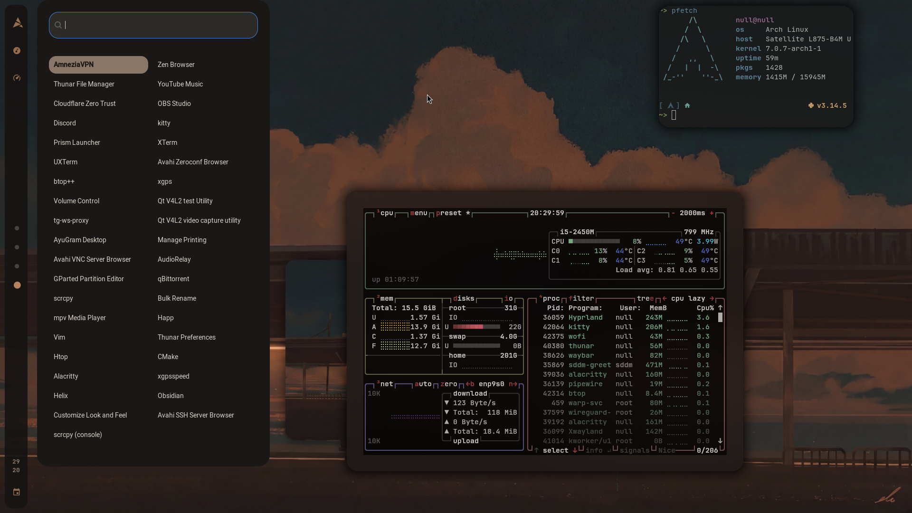

# 🚀 Rice Generator

Генерация конфигов для **Hyprland**, **Waybar**, **Wofi** и **Kitty** на основе скриншотов с использованием мультимодальной ИИ-модели.

## ✨ Возможности

- 📸 **Анализ скриншотов** — распознавание цветовой схемы, шрифтов, компоновки
- 🎨 **Генерация конфигов** — создание конфигурационных файлов на основе анализа
- 🖼️ **Генерация обоев** — AI создаёт 4K обои под стиль скриншота (DALL-E, Flux и др.)
- 🔧 **Installer** — автоматическая установка конфигов с бэкапом
- ↩️ **Uninstaller** — откат изменений и восстановление из бэкапа
- 🤖 **AI-powered** — использует Google Gemini через OpenRouter или CometAPI
- 🖼️ **Генерация обоев** — извлекает и воссоздаёт обои со скриншота (отдельная модель)
- 📝 **Свой конфиг Hyprland** — используйте свой конфиг как шаблон
- 🛡️ **AI-валидация** — автоматическая проверка и исправление конфигов со скриншотом

## 📋 Требования

- Python 3.10+
- API ключ (OpenRouter или CometAPI)
- Установленные Hyprland, Waybar, Wofi, Kitty (для применения конфигов)
- Опционально: swaybg (для установки обоев)

## 🚀 Быстрый старт

### 1. Клонирование репозитория

```bash
git clone https://github.com/nullx137/Rice-generator
cd Rice-generator
```

### 2. Установка зависимостей

```bash
python -m venv venv
source venv/bin/activate
pip install -r requirements.txt
```

### 3. Настройка API ключа

```bash
cp .env.example .env
nano .env  # Вставьте свой API ключ
```

**Получение API ключа:**

- **OpenRouter:** [openrouter.ai](https://openrouter.ai/)
- **CometAPI:** [cometapi.com](https://cometapi.com/)

### 4. Использование

```bash
# Базовое использование (OpenRouter)
python -m rice_generator screenshot.png -o ./my-rice

# Использовать CometAPI
python -m rice_generator screenshot.png --provider cometapi -o ./my-rice

# С генерацией обоев (отдельная модель)
python -m rice_generator screenshot.png --provider cometapi --wallpaper-model google/gemini-3-pro-image-preview -o ./my-rice

# Отключить генерацию обоев
python -m rice_generator screenshot.png --no-wallpaper -o ./output

# Использовать свой конфиг Hyprland как шаблон
python -m rice_generator screenshot.png -H ~/.config/hypr/hyprland.conf -o ./my-rice

# С указанием API ключа и модели
python -m rice_generator screenshot.png --api-key your_key -m google/gemini-3-flash-preview -o ./output

# Генерация с обоями через DALL-E
python -m rice_generator screenshot.png --wallpaper-model openai/dall-e-3 -o ./output
```

## 📖 Команды CLI

```
usage: rice-generator [-h] [-o OUTPUT] [--api-key API_KEY] [--provider PROVIDER] [-m MODEL] [--wallpaper-model WALLPAPER_MODEL] [--no-wallpaper] [-t TEMPLATES] [-H HYPRLAND_CONFIG] [-v] [--version]
=======
usage: rice-generator [-h] [-o OUTPUT] [--api-key API_KEY] [--provider PROVIDER]
                      [-m MODEL] [--wallpaper-model WALLPAPER_MODEL]
                      [-t TEMPLATES] [-H HYPRLAND_CONFIG] [-v] [--version]
                      screenshot

positional arguments:
  screenshot            Путь к скриншоту для анализа

options:
  -h, --help            Показать справку
  -o OUTPUT, --output OUTPUT
                        Директория для сохранения конфигов (по умолчанию: ./generated_configs)
  --api-key API_KEY     API ключ (для OpenRouter или CometAPI)
  --provider PROVIDER   API провайдер: openrouter или cometapi (по умолчанию: openrouter)
  -m MODEL, --model MODEL
                        Модель для анализа (по умолчанию: google/gemini-3-flash-preview)
  --wallpaper-model WALLPAPER_MODEL
                        Модель для генерации обоев (по умолчанию: google/gemini-3-pro-image-preview)
  --no-wallpaper        Отключить генерацию обоев
=======
                        Модель для генерации обоев (по умолчанию: openai/dall-e-3)
  -t TEMPLATES, --templates TEMPLATES
                        Директория с шаблонами
  -H HYPRLAND_CONFIG, --hyprland-config HYPRLAND_CONFIG
                        Путь к вашему hyprland.conf (вместо встроенного шаблона)
  -v, --verbose         Подробный вывод
  --version             Версия
```

## 🏗️ Как это работает

1. **Загрузка скриншота** — вы указываете путь к скриншоту вашего рабочего стола
2. **Раздельная генерация** — для каждого компонента (Hyprland, Waybar, Wofi, Kitty) отправляется отдельный запрос к ИИ
3. **Генерация обоев** — ИИ создаёт промпт для генерации 4K обоев и получает изображение
4. **AI-валидация** — все сгенерированные конфиги проверяются на соответствие скриншоту и автоматически исправляются
5. **Создание скриптов** — генерируются `installer.sh` и `uninstaller.sh`

## 📁 Структура проекта

```
rice-generator/
├── rice_generator/
│   ├── __init__.py           # Инициализация пакета
│   ├── __main__.py           # Точка входа CLI
│   ├── cli.py                # CLI интерфейс
│   ├── main.py               # Основной класс RiceGenerator
│   ├── openrouter_client.py  # Унифицированный клиент API (OpenRouter / CometAPI)
│   ├── separate_generator.py # Генератор с раздельными запросами для каждого компонента
│   ├── config_parser.py      # Парсер ответа ИИ и генератор файлов
│   ├── config.py             # Настройки проекта
│   ├── validator.py          # ИИ-валидация и автоисправление конфигов
│   └── templates/
│       ├── hyprland.conf     # Шаблон Hyprland
│       ├── waybar.json       # Шаблон Waybar (config)
│       ├── waybar_style.css  # Шаблон Waybar (style)
│       ├── wofi_config       # Шаблон Wofi (config)
│       ├── wofi_style.css    # Шаблон Wofi (style)
│       └── kitty.conf        # Шаблон Kitty
├── .env.example              # Пример конфигурации
├── .gitignore
├── requirements.txt
└── README.md
```

## 🔧 Как это работает

1. **Загрузка скриншота** — вы указываете путь к скриншоту вашего рабочего стола
2. **Анализ ИИ** — модель Google Gemini анализирует:
   - Цветовую схему (цвета фона, текста, акцентов)
   - Шрифты и размеры
   - Отступы (gaps, padding)
   - Расположение элементов (бар, иконки, лаунчер)
   - Прозрачность и закругления
3. **Генерация конфигов** (раздельными запросами к ИИ):
   - **Hyprland** — модифицирует шаблон (заменяет gaps, цвета, opacity, rounding, shadow, blur)
   - **Waybar** — создаётся `config.json` и `style.css`
   - **Wofi** — создаётся `config` и `style.css` для лаунчера
   - **Kitty** — создаётся `kitty.conf` с цветовой схемой
   - **Обои** — извлекает фон со скриншота и генерирует `wallpaper.png` (через отдельную image generation модель)
4. **ИИ-валидация** — нейросеть проверяет визуальное соответствие конфигов скриншоту и исправляет расхождения (только визуальные параметры, не трогая бинды и функциональные настройки)
5. **Создание скриптов** — генерируются `installer.sh` и `uninstaller.sh`

=======
## 📦 Выходные файлы

После генерации вы получите:

```
output/
├── hyprland.conf         # Конфиг Hyprland
├── waybar_config.json    # Конфиг Waybar
├── waybar_style.css      # Стили Waybar
├── wofi_config           # Конфиг Wofi
├── wofi_style.css        # Стили Wofi
├── kitty.conf            # Конфиг Kitty
├── wallpaper.png         # Сгенерированные обои (если включено)
=======
├── wallpaper.png         # Сгенерированные обои (опционально)
├── color_scheme.json     # Информация о цветовой схеме
├── installer.sh          # Скрипт установки
└── uninstaller.sh        # Скрипт отката
```

## 🛠️ Применение конфигов

```bash
cd output/
chmod +x installer.sh
./installer.sh
```

Скрипт:
- Создаст бэкап текущих конфигов в `~/.config/rice_backups/`
- Установит новые конфиги (Hyprland, Waybar, Wofi, Kitty)
<<<<<<< HEAD
- Установит обои `wallpaper.png` в `~/.config/hypr/wallpaper.png` (если были сгенерированы)
- Перезапустит Waybar
=======
- Установит обои через swaybg (если сгенерированы)
>>>>>>> 19bba975c3ba1563a80f2431b927745f39e0d1e4

## ↩️ Откат изменений

```bash
./uninstaller.sh
```

Скрипт удалит установленные конфиги и предложит восстановить один из бэкапов.

## 🎨 Использование своего конфига Hyprland

Если вы хотите модифицировать свой существующий конфиг:

```bash
python -m rice_generator screenshot.png -H ~/.config/hypr/hyprland.conf -o ./output
```

**Что изменит ИИ:**
- `gaps_in` / `gaps_out` — отступы
- `col.active_border` / `col.inactive_border` — цвета рамок
- `active_opacity` / `inactive_opacity` — прозрачность
- `rounding` — скругления
- `shadow.*` — тени
- `blur.*` — блюр
- `border_size` — толщина рамок

**Что останется без изменений:**
- binds (горячие клавиши)
- input настройки
- monitor настройки
- windowrules

## 🖼️ Генерация обоев

По умолчанию генерация обоев включена. ИИ анализирует скриншот, создаёт промпт и генерирует 4K обои через модель для генерации изображений. Установка обоев производится через `swaybg`.

```bash
# Использовать DALL-E для генерации обоев
python -m rice_generator screenshot.png --wallpaper-model openai/dall-e-3
```

## 🔑 Получение API ключа

### OpenRouter
1. Зарегистрируйтесь на [openrouter.ai](https://openrouter.ai/)
2. Перейдите в раздел API Keys
3. Создайте новый ключ
4. Скопируйте и вставьте в `.env`

### CometAPI
1. Зарегистрируйтесь на [cometapi.com](https://cometapi.com/)
2. Перейдите в раздел API Keys
3. Создайте новый ключ
4. В `.env` укажите `API_PROVIDER=cometapi` и `COMETAPI_API_KEY=ваш_ключ`

## ⚙️ Переменные окружения

| Переменная | Описание | По умолчанию |
|------------|----------|--------------|
| `API_PROVIDER` | Провайдер API: `openrouter` или `cometapi` | `openrouter` |
| `OPENROUTER_API_KEY` | API ключ OpenRouter | (обязательно для openrouter) |
| `COMETAPI_API_KEY` | API ключ CometAPI | (обязательно для cometapi) |
| `COMETAPI_BASE_URL` | URL CometAPI | `https://api.cometapi.com/v1` |
<<<<<<< HEAD
| `RICE_MODEL` | Модель для анализа | `google/gemini-3-flash-preview` |
| `WALLPAPER_ENABLED` | Включить генерацию обоев (`true`/`false`) | `true` |
| `WALLPAPER_MODEL` | Модель для генерации обоев | `google/gemini-3-pro-image-preview` |
=======
| `RICE_MODEL` | Модель для анализа скриншота | `google/gemini-3-flash-preview` |
| `WALLPAPER_MODEL` | Модель для генерации обоев | `openai/dall-e-3` |
| `WALLPAPER_TOOL` | Инструмент для установки обоев | `swaybg` |
>>>>>>> 19bba975c3ba1563a80f2431b927745f39e0d1e4
| `REQUEST_TIMEOUT` | Таймаут запроса (сек) | `120` |
| `MAX_RETRIES` | Количество повторных попыток | `3` |
| `MAX_TOKENS` | Общий лимит токенов | `16384` |
| `HYPRLAND_MAX_TOKENS` | Лимит токенов для Hyprland | `8000` |
| `WAYBAR_MAX_TOKENS` | Лимит токенов для Waybar | `6000` |
| `KITTY_MAX_TOKENS` | Лимит токенов для Kitty | `3000` |
| `VALIDATE_ANALYSIS_TOKENS` | Лимит токенов для анализа | `4000` |
| `VALIDATE_FIX_TOKENS` | Лимит токенов для исправления | `8000` |
| `REQUEST_DELAY` | Задержка между запросами (сек) | `10` |
| `HTTP_REFERER` | Referer для OpenRouter API | `https://github.com/rice-generator` |
| `APP_TITLE` | Заголовок приложения | `Rice Generator` |
| `VERBOSE` | Подробный вывод | `false` |

## 📸 Пример работы

Результат генерации rice на основе скриншота:

| Исходник (скриншот) | Результат (сгенерировано) |
|:---:|:---:|
|  |  |


## 🖥️ Примеры команд

### Генерация с выводом в кастомную директорию

```bash
python -m rice_generator ~/Pictures/my-rice.png -o ~/.config/rice-themes/blue
```

### Использование своих шаблонов

```bash
python -m rice_generator screenshot.png \
    --templates ./my-templates \
    --output ./my-rice
```

### Свой конфиг Hyprland + подробный режим

```bash
python -m rice_generator screenshot.png \
    -H ~/.config/hypr/hyprland.conf \
    -v
```

### Использование CometAPI

```bash
# Через аргументы
python -m rice_generator screenshot.png --provider cometapi --api-key YOUR_KEY -o ./output

# Через переменные окружения
export API_PROVIDER=cometapi
export COMETAPI_API_KEY=your_key
python -m rice_generator screenshot.png -o ./output
```

### Генерация с кастомной моделью и обоями

```bash
python -m rice_generator screenshot.png \
    -m google/gemini-3-flash-preview \
    --wallpaper-model openai/dall-e-3 \
    -o ./my-rice
```

## ⚠️ Ограничения

- Точность зависит от качества скриншота
- Некоторые элементы могут быть распознаны неверно
- Требуется ручная проверка конфигов перед применением
- Модель может не распознать кастомные шрифты
- Генерация обоев может занять продолжительное время
- API имеет ограничения по количеству запросов
